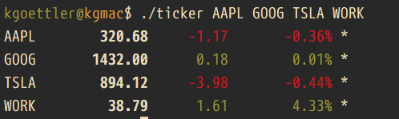

# ticker.c

Stock Ticker CLI written in C.



This is a port of [ticker.sh](https://github.com/pstadler/ticker.sh) 
by [pstadler](https://github.com/pstadler). This port came out of me
wanting to learn libcurl and libjson-c.

# Building and Installing

```bash
$ git clone https://github.com/kgoettler/ticker-c.git
$ cd ticker-c
$ cc ticker.c -lcurl -ljson-c -o ticker
```
